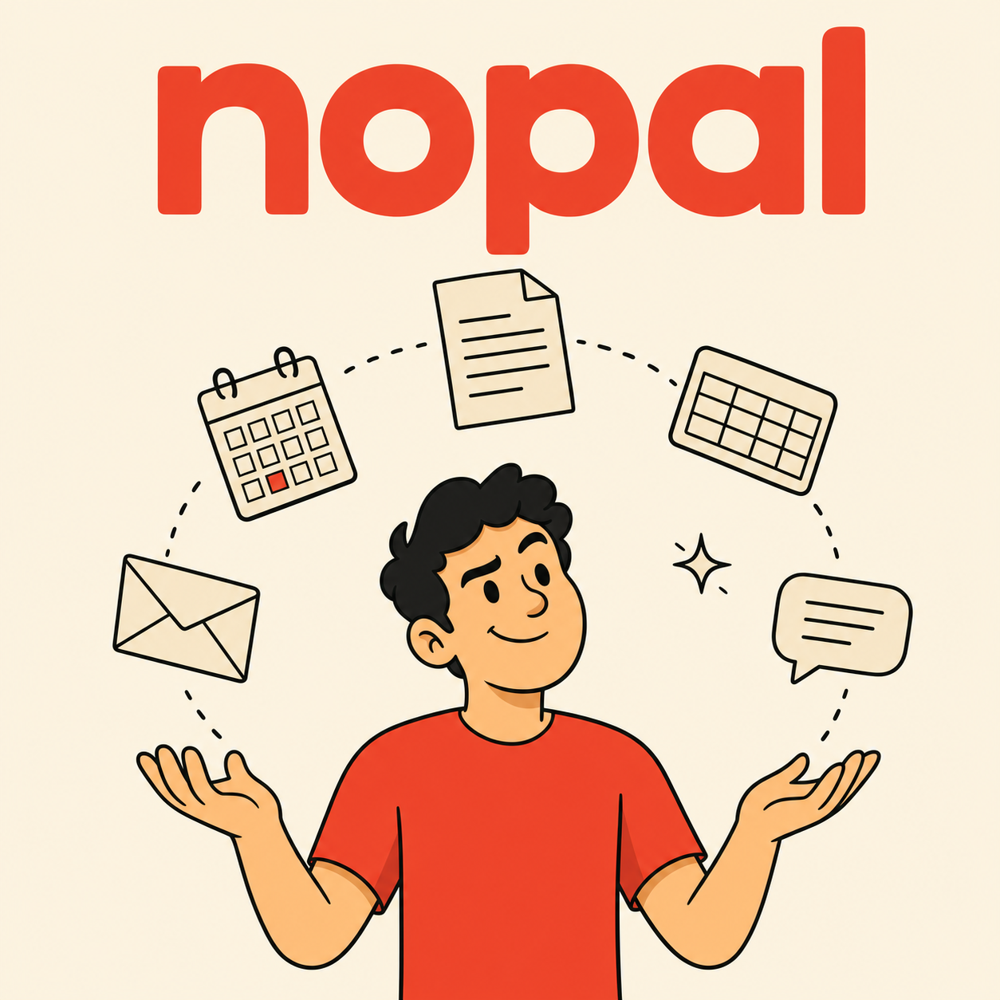

[English](README.md) | [한국어](README.ko.md) | [中文](README.zh.md) | 日本語 | [Español](README.es.md)

# nopal

<p align="center">
  
</p>

> **自然言語で動く Google Workspace オーケストレーション。**

ふつうの一文が、Gmail、Calendar、Drive、Docs、Sheets、Slides、Meet、Tasks、Chat を連携させたアクションに変わります——Claude Code から一歩も出ることなく。

[クイックスタート](#クイックスタート) • [なぜ nopal？](#なぜ-nopal) • [仕組み](#仕組み) • [対応サービス](#対応サービス) • [動作要件](#動作要件)

---

## クイックスタート

### 1. マーケットプレイスを追加（初回のみ）

```
/plugin marketplace add https://github.com/fivetaku/gptaku_plugins.git
```

### 2. nopal をインストール

```
/plugin install nopal
```

インストール後、Claude Code を再起動してください。

### 3. gws CLI をセットアップ（初回のみ）

nopal は [gws CLI](https://github.com/googleworkspace/cli) を使って Google Workspace と通信します。まずインストールします：

```bash
npm install -g @googleworkspace/cli
```

次に、ターミナルで一度だけ OAuth セットアップを実行します：

```bash
gws auth setup
```

GCP プロジェクトの作成、9 つの Workspace API の有効化、Google アカウントの認可を順に案内してくれます。セットアップが済んだらログインします：

```bash
gws auth login
```

ログイン後、Claude Code が headless モードで gws を使えるように認証情報をエクスポートします：

```bash
gws auth export --unmasked 2>/dev/null | grep -v '^Using keyring' > ~/.config/gws/credentials.json
chmod 600 ~/.config/gws/credentials.json   # 平文トークン — 非公開に保ち、絶対にコミットしないこと
```

### 4. 実行

```
/nopal
```

引数は不要です——nopal のほうから何をしたいか聞いてくれます。直接指示しても構いません：

```
/nopal 明日の朝10時にチームのスタンドアップを設定して、参加者にアジェンダをメールして
/nopal 未読メールを確認して、重要なものだけ要約して
/nopal 議事録ドキュメントを作成して、先週の参加者に共有して
/nopal Sheets から Q1 の売上データを取得して、サマリーをチームチャットに送って
```

---

## なぜ nopal？

- **1 コマンドであらゆるサービスへ** —— やりたいことを普通の言葉で伝えるだけで、どのサービスをどの順番で呼ぶかを nopal が判断します
- **動的な組み合わせ** —— 固定のワークフロー集ではなく、リクエストごとにサービスを選択して連結します
- **インタビュー駆動** —— 情報が足りなければ、実行前に質問します（実行後ではなく）
- **読み取りと書き込みの区別** —— 読み取り専用のクエリは即実行、書き込みや変更のアクションは必ず事前に確認を取ります
- **Claude Code の中で完結** —— 新しいアプリも、ブラウザタブも、コンテキストスイッチも不要
- **認証情報は gws の中に** —— OAuth フローは gws CLI が担います。headless 用途ではトークンをローカルの `~/.config/gws/credentials.json` にエクスポートします（`chmod 600` を維持し、絶対にコミットしないこと）。nopal が Claude 側に認証情報を埋め込むことはありません

---

## 仕組み

```
あなた: 「明日の午後2時にチーム会議を設定して、参加者にメールして」
     │
     ▼
/nopal
     │
     ├─ gws 未インストール？ → 自動インストールを試行 / セットアップを案内
     │
     └─ gws 準備完了 → オーケストレーション開始
          │
          ├─ 1. 意図の解析      — どのサービスが必要か？
          ├─ 2. インタビュー    — ライブデータを取得し、足りない情報だけ質問
          ├─ 3. 計画            — 書き込みアクションは確認、読み取り専用はスキップ
          ├─ 4. 実行            — gws コマンドを順に実行
          └─ 5. レポート        — 結果を要約 + 次のステップを提案
```

複数サービスにまたがるリクエストも自然に解決します：

- 「明日の会議に参加者を追加して、ドキュメントを送って」 → Calendar + Drive + Gmail
- 「Sheets のデータからニュースレターを作って送信して」 → Sheets + Gmail
- 「議事録を書いてチームの Chat スペースに投稿して」 → Docs + Chat

---

## 対応サービス

| サービス | nopal ができること | ヘルパーコマンド |
|---------|-------------------|-----------------|
| Gmail | 送信・読み取り・トリアージ・監視 | `+send`, `+triage`, `+watch` |
| Calendar | イベント作成、予定の確認 | `+insert`, `+agenda` |
| Drive | ファイルのアップロード、共有の管理 | `+upload` |
| Sheets | スプレッドシートの読み取り／追記 | `+read`, `+append` |
| Docs | ドキュメントの読み書き | `+write` |
| Slides | プレゼンテーションの作成・編集 | — |
| Chat | スペースへのメッセージ送信 | `+send` |
| Tasks | ToDo リストの管理 | — |
| Meet | 会議リンクの作成、参加者と文字起こしの取得 | — |

---

## 既知の問題

| 問題 | 状態 | 回避策 |
|-------|--------|------------|
| Gmail trash の 411 エラー | gws 0.6.1+ で修正済み | 最新バージョンを使用 |
| `+send` の韓国語エンコーディング | gws CLI のバグ | raw API エンコーディングを自動適用 |
| `gws auth export` のログ混入 | `Using keyring backend` が JSON に混ざる | `2>/dev/null \| grep -v '^Using keyring'` フィルタを適用済み |

---

## 動作要件

- [Claude Code](https://docs.anthropic.com/en/docs/claude-code)
- [gws CLI](https://github.com/googleworkspace/cli) — `npm install -g @googleworkspace/cli`
- Google Workspace アカウント + OAuth セットアップ（`gws auth setup` + `gws auth login`）
- Node.js 18 以上

> 初めて `/nopal` を実行すると、gws の有無を確認し、セットアップを自動で案内します。

---

## ライセンス

MIT

---

<div align="center">

**No Opal needed. —— Opal は要りません。**

</div>
